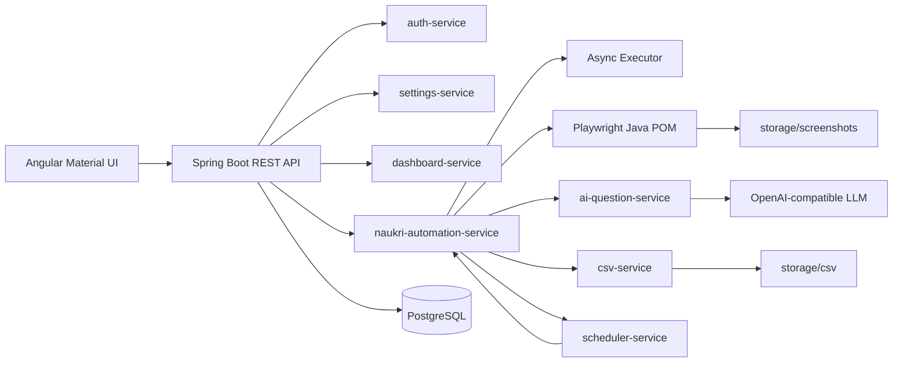

# Naukri AI Job Apply Bot Architecture

The backend is layered by controller, service, repository, DTO, and domain packages. Playwright automation is isolated in the `automation` Maven module so browser behavior can be tested and evolved independently from API concerns.
